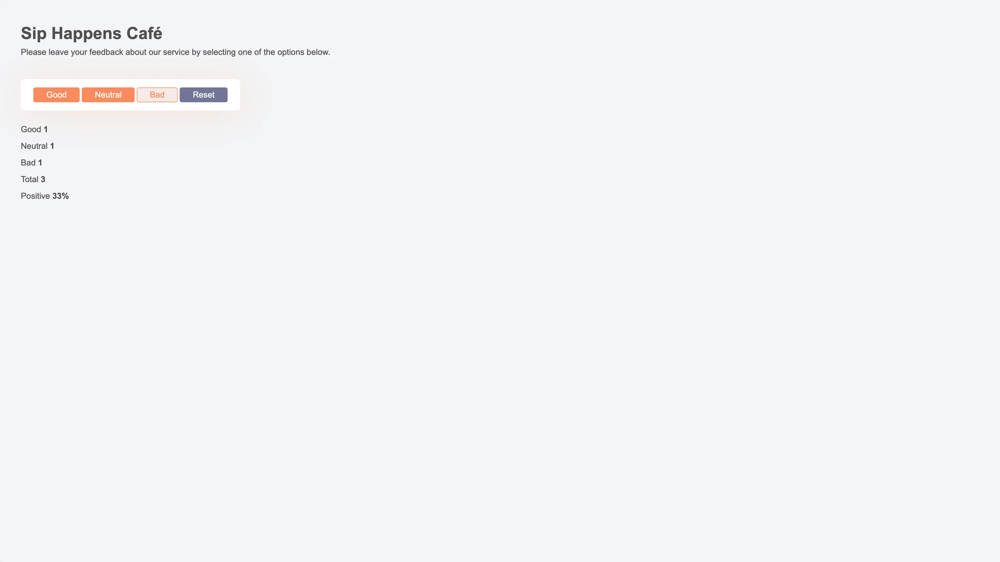

# React Feedback Widget App

## Module 2: State, hooks useState

This repository contains the implementation of a feedback widget for the café "Sip Happens Café". The project was created using Vite and is structured to adhere to React best practices. The application collects feedback and displays statistics for each category (good, neutral, bad), preserving data between page reloads.

## Functionality Summary

- **Feedback Collection**:

  - Collect feedback in three categories: good, neutral, and bad.
  - Display the collected feedback statistics.
  - Reset feedback statistics.

- **Component Structure**:

  - Each component is organized in its own folder within `src/components`.
  - Default exports are used for all components.

- **Code Quality**:

  - Ensured no errors or warnings in the console.
  - Maintained clean and understandable JavaScript code using Prettier for formatting.
  - Styling was performed using CSS modules.

## Live Demo

- **Source Files**: [GitHub Repository](https://github.com/grifano/goit-react-hw-02.git)
- **Working Page**: [Live Preview](https://goit-react-hw-02-six-sage.vercel.app/)

## Project Setup

1. Clone the repository.
2. Install dependencies: `npm install`
3. Start the development server: `npm run dev`

## Code Quality

- Ensured no errors or warnings in the console.
- Maintained clean and understandable JavaScript code using Prettier for formatting.

## Component List

- `App`: The root component containing the main structure and state management.
- `Feedback`: Displays the collected feedback statistics.
- `Options`: Provides buttons for submitting feedback and resetting statistics.
- `Notification`: Displays a message when no feedback has been collected.

## Acknowledgments

[GOIT](https://edu.goit.global/uk/referral?x=eyJlbWFpbCI6InNvcmxlbmtAZ21haWwuY29tIiwiZmlyc3ROYW1lIjoi0KHQtdGA0LPRltC5IiwibG9jYWxlIjoidWsiLCJsYW5ndWFnZSI6InVrIiwidG90YWxIb3VycyI6NzcsImN1cnJlbnRPckxhc3RUZWNobm9sb2d5IjoiSFRNTF9DU1MiLCJwYXNzZWRIb21ld29ya3NDb3VudCI6NX0=) -
big love to GoIT team for their patience, afford, help, and positivity that they
share with us ❤️

## Author

- Website - [www.grifano.com](https://grifano.com)
- Frontend Mentor -
  [www.frontendmentor.com](https://www.frontendmentor.io/profile/grifano)
- LinkedIn - [www.linkedin.com](https://www.linkedin.com/in/grifano/)
